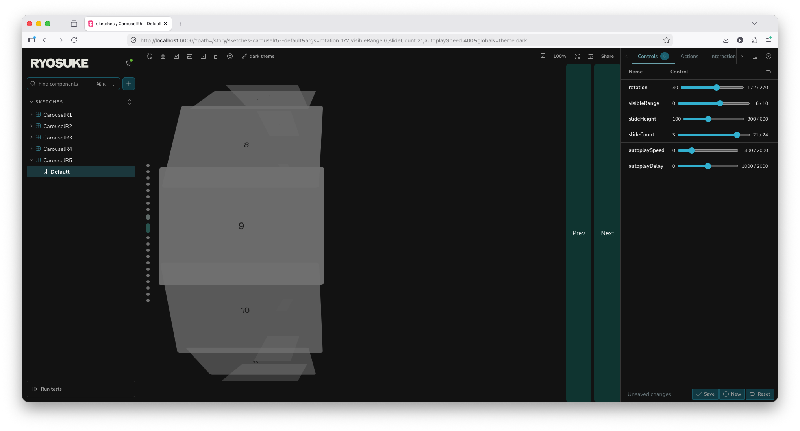

# Ryo's Component Sketchbook 2026

A little sketchbook for experimenting with UI and interactivity.

## Features

- Storybook
- ReactJS
- React Icons
- MotionJS
- Keyboard/Gamepad input
- OpenCode setup

## Requirements

- NodeJS
- pnpm

## Development

This project uses Storybook to manage each "sketch" and render them in isolation.

1. Install deps: `pnpm install`
1. Spin up Storybook: `pnpm storybook`

Then you can browse the Storybook instance: http://localhost:6006/

### Keyboard/Gamepad input

Input is exposed via a Zustand store which you can subscribe to using the `useInputStore()` hook. It has an `input` property with an input map with general controls like "up", "down", or "cancel" (just like a video game). 

```tsx
const input = useInputStore((state) => state.input);

useEffect(() => {
    if (input.up) handlePrev();
    if (input.down) handleNext();
}, [input.up, input.down])
```

You can also check out other properties, like seeing what the latest input device was (keyboard vs gamepad) - or checking device information (like the gamepad name).

### LLM / OpenCode

This project is setup to be used with OpenCode or LLMs if needed.

To get started run `opencode` or `opencode web` in project. Then start the Storybook server if you want to use that MCP.

The LLM has access to the Storybook and Panda CSS MCPs, which should let you do things like:

- Quickly create or edit stories (like adding controls from existing props).
- Create entire components using the Panda CSS styling paradigm.
- Review existing code and provide feedback and improvements.
- Run Storybook testing to validate code.
- Introspect the design system and see what tokens are used most.

> Note if you want to avoid cloud-based models and use local models on your PC, I recommend using the Qwen Coder or Google's Gemma series - they handle the tool-based workflow better. Avoid models like GPT. Ultimately though, nothing compares to the cloud-based models and how optimized they are, so consider trying the free options available from OpenCode.